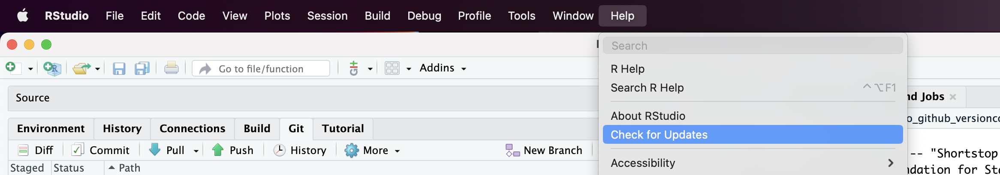

# **Install or upgrade R and RStudio**

::: questions
### **Questions** {.unlisted}

-   Have you installed R? Do you have the latest version?
-   Have you installed RStudio? Do you have the latest version?
:::

You need to have R as well as RStudio, a software application that makes R easier to use, installed on your computer.

## Install R

R is maintained by an international team of developers who make the language available through the web page of [The Comprehensive R Archive Network](https://cran.r-project.org). The top of the web page provides three links for downloading R. Follow the link that describes your operating system: **Windows**, **Mac**, or **Linux**.

## Install RStudio

RStudio is an application like Microsoft Word---except that instead of helping you write in English, RStudio helps you write in R. The RStudio interface looks the same for Windows, Mac OS, and Linux. You can [download RStudio](https://posit.co/products/open-source/rstudio/) for free. Click the "Download RStudio" button and follow the instructions that follow. Once you've installed RStudio, you can open it like any other program on your computer---usually by clicking an icon on your desktop.

### Check your versions

If you already have R and RStudio installed, this is a good time to make sure your installations is current.

-   **Check your current R version** by opening RStudio and using the command below on the Console:

``` default
R.version.string
```

-   **Check your current RStudio version** by opening RStudio and navigating through **Help** -\> **Check for updates**:



-   **Update your R packages**

Open RStudio and use the command below on the Console:

``` default
update.packages(ask = FALSE, checkBuilt = TRUE)
```
