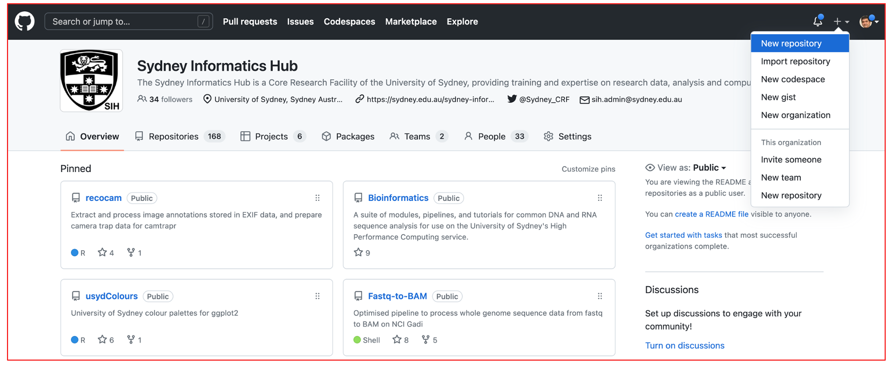
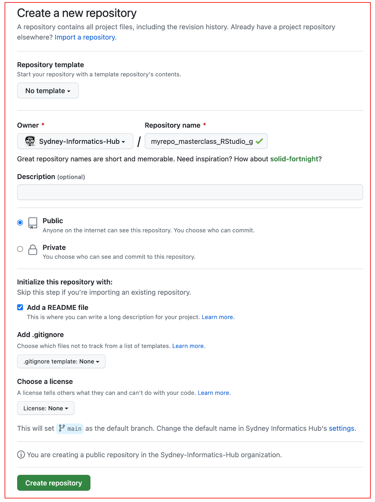
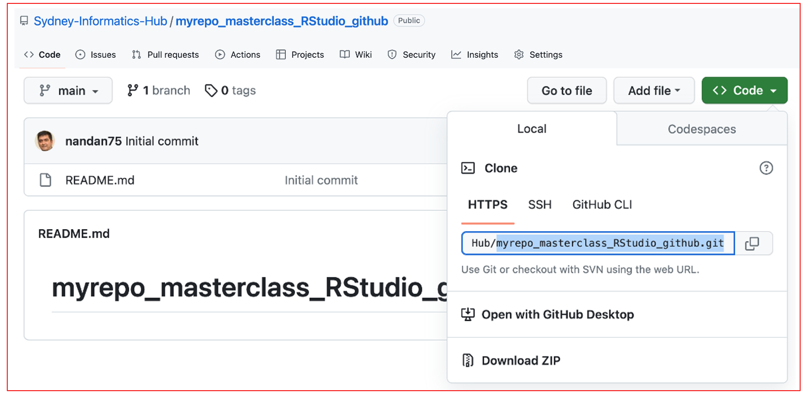

# **Create and update a new repository on GitHub**

::: questions
### **Questions** {.unlisted}

- How to  create a test github repository? 
:::

### **Create a new repository**
For todays code-along session, you will need a test repository (or repo) on GitHub  
- Go to `https://github.com/`  
- Log in (if not logged in already)  
\
- Click on the `+` symbol on the right hand top corner  
- Select `New repository`


This opens a new form as shown below. Please select the following options:  
- **Repository template**: No template  
- **Repository name**: `myrepo_masterclass_RStudio_github` or any other name of your choice  
- **Description**: `Repository for testing my Git/GitHub setup` or similar    
- Choose `Public`    
- Initialize this repository by checking the `Add a README file` option  
- Click on 

This creates a new repository called `myrepo_masterclass_RStudio_github` or whatever name you have provided
\
\

### **Clone the new repository to local machine**
- Click the big green button that says   
- Copy the clone URL to your clipboard  
- Since we have created a PAT for HTTPS protocol , copy the HTTPS URL as shown below.
  

and type the following code on your terminal:  

`git clone HTTPS_URL`  
e.g. `git clone myrepo_masterclass_RStudio_github`

``` default
~/master_class % git clone https://github.com/Sydney-Informatics-Hub/myrepo_masterclass_RStudio_github.git
Cloning into 'myrepo_masterclass_RStudio_github'...
remote: Enumerating objects: 3, done.
remote: Counting objects: 100% (3/3), done.
remote: Total 3 (delta 0), reused 0 (delta 0), pack-reused 0
Receiving objects: 100% (3/3), done.
```

I have named my repo as `myrepo_masterclass_RStudio_github`. 


::: keypoints
### **Key points** {.unlisted}

- You can choose to use an available template when creating a new repository .  
- The choice of your repository being `Public` or `Private` needs to be carefully considered.

:::

