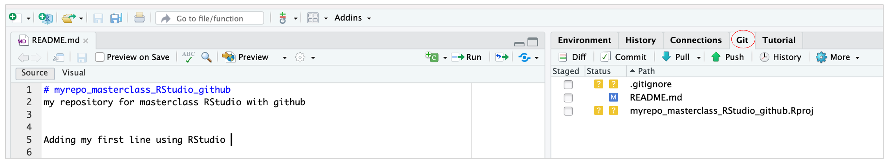

# **Make local changes and push them to github using RStudio**

::: questions
### **Questions** {.unlisted}

-   How to use RStudio to push local changes to github?
:::

 

### **Make local changes, save and commit**

In our project, we can perform the following independent tasks.

(1) In RStudio, click on the README.md file, and edit it e.g., by adding a line -  "This is a line from RStudio". Save your changes.

- The files marked with  in the git pane of RStudio, suggests that they are untracked. This means that git is not tracking versions of these files.  
- Git will only keep track of modifications to files that it has been asked to manage, so you need to tell git which files to track.  
- Tick the Staged checkbox for each file.

Commit these changes to your local repo.  
**How do you do that in RStudio:**  
-   Click the "Git" tab in upper right pane  
-   Check "Staged" box for README.md  
-   If you're not already in the Git pop-up, click "Commit"  
-   Type a message in "Commit message", such as "Commit from RStudio"  
-   Click "Commit"  

(2) Since we primarily work with Rmarkdown files when using RStudio, we can try and repeat the above steps for a Rmarkdown file:

-   In RStudio `File -> New File -> R Markdown`  
-   The Rmarkdown file contains default code to generate some plots  
-   Once you create the new file, this change can be directly staged to the GitHub repo by repeating the above steps  

### **Push your local changes online to GitHub**

Click the green arrow "Push" button to send your local changes to GitHub.

Ideally you should not experience any issue when pushing the changes to the github server as you have previously done similar push from the command line  

The RStudio's Git pane provides a specific subset of command line Git through its interface. So, if your credentials work in the shell, they should work in RStudio  

> Note that if RStudio asks for your Git username and password, you should use your `Personal Access Token` as the password, not your GitHub password.

### **Confirm the local change propagated to the GitHub remote**

Go back to the browser. I assume we're still viewing your new GitHub repo.

**Refresh**

You should see the new "This is a line from RStudio" in the README and the new Rmarkdown file you have created within RStudio.

If you click on "commits", you should see one with the message "Commit from RStudio".

If you have made it this far, **Congratulations!** You have been successful in backing up changes on you local machine using RStudio to the GitHub server.

::: keypoints
### **Key points** {.unlisted}
- RStudio has several features that make it easy to work with Github.  
- Using RStudio you can clone, commit, push, and pull changes to your repositories without having to switch to a separate Git client.

:::