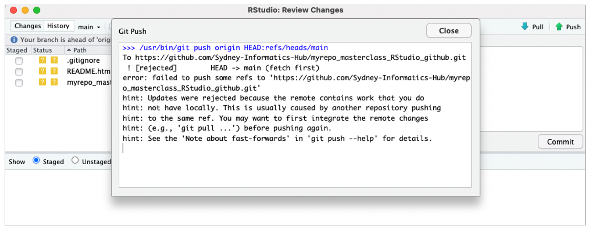
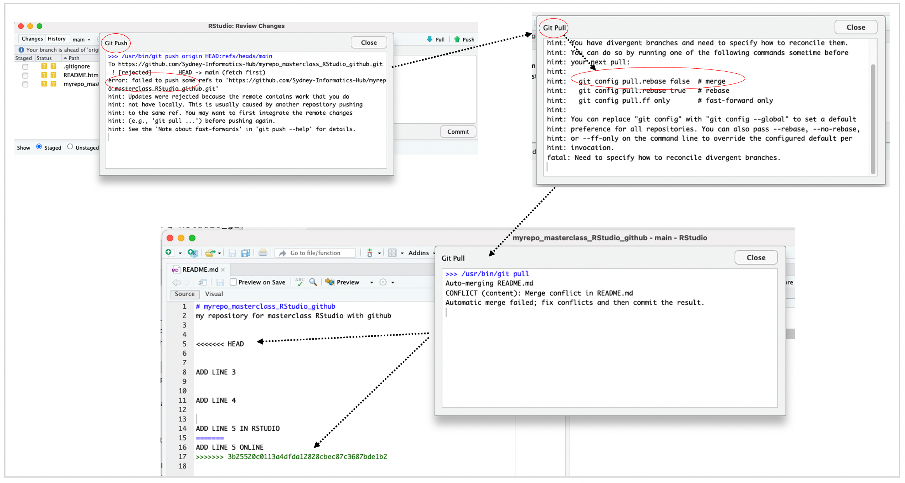

# **Conflict in git and how does RStudio assist**

::: questions
### **Questions** {.unlisted}

-   What is a conflict in git?
:::

 

### **What are conflicts when working in git**
Conflicts can occur for various reasons:  
- When two or more users make changes to the same file or files simultaneously, or   
- When a user merges branches or commits that have diverged  
- When Git detects a conflict, it stops the merge process and marks the affected file(s) with conflict markers that indicate the conflicting changes.

### **Simulating a conflict for a user**
#### **Step 1**
- Make some text changes in your Readme.md file in RStudio  
- Stage (add), commit and push as before  
- Are the changes reflected in the online repository?  

#### **Step 2**
- Go to the online repository and edit the Readme.md file (add/remove some lines) , commit the changes.

#### **Step 3**
- Get back to your RStudio and  make additional changes and try to stage  (add), commit and push them  
- Do you get a conflict?    

- Why do think this happened?    

A good workflow when working with git (either by yourself or in collaboration)- 

`Pull -> Edit -> Add -> Pull -> Commit -> Push`  

### **Resolving the conflict**

::: keypoints
### **Key points** {.unlisted}
- RStudio makes it easy to indetify and resolve conflicts

:::
